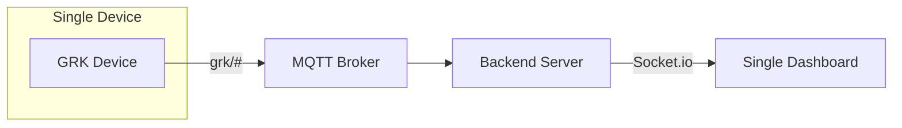
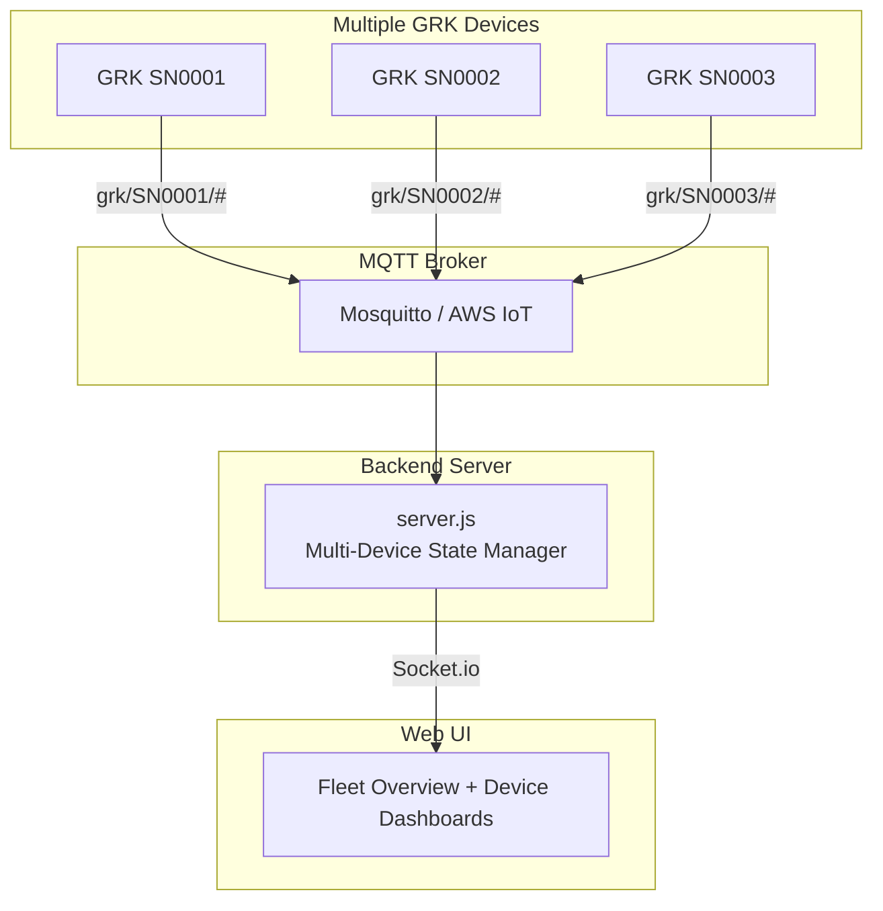

# Multi-Device Support & Serial Number Implementation Plan

> **Created:** 2025-12-29  
> **Status:** Planning  
> **Author:** Development Team

---

## Overview

This document outlines the plan to extend the GRK IoT system to support **multiple devices** identified by **unique serial numbers**. The serial numbers will be burned to flash memory separately from firmware uploads, ensuring device identity persists across updates.

---

## Table of Contents

1. [Current Architecture](#current-architecture)
2. [Proposed Architecture](#proposed-architecture)
3. [Serial Number Implementation](#serial-number-implementation)
4. [MQTT Topic Structure](#mqtt-topic-structure)
5. [Web UI Changes](#web-ui-changes)
6. [Implementation Steps](#implementation-steps)

---

## Current Architecture



### Current Limitations
- Only supports **one device** at a time
- No unique device identification
- All MQTT topics use hardcoded `grk/` prefix
- Web UI displays single device state

---

## Proposed Architecture



---

## Serial Number Implementation

### Flash Storage Structure

The serial number will be stored in the device's flash memory using the existing `FlashStorage` library, extending the current `Config` struct.

#### Updated Config Struct (`main.cpp`)

```cpp
struct Config {
  // Existing fields
  byte controller_ip_bytes[4];
  byte whitelist_ip_bytes[10][4];
  int whitelist_count;
  
  // NEW: Serial Number Configuration
  char serial_number[16];      // Up to 15 chars + null terminator (e.g., "SN0001")
  bool serial_number_set;      // Flag indicating if SN has been programmed
  uint32_t validation_marker;  // Validation marker (e.g., 0xCAFECAFE)
  
  // Constructor with defaults
  Config() : whitelist_count(0), serial_number_set(false), validation_marker(0) {
    // ... existing default IP setup ...
    memset(serial_number, 0, sizeof(serial_number));
    strcpy(serial_number, "UNCONFIGURED");
  }
};
```

### Serial Number Functions

```cpp
// Global variable for quick access
String deviceSerialNumber = "UNCONFIGURED";

// Load serial number from flash (call in setup())
void loadSerialNumber() {
    Config config_data = config_store.read();
    if (config_data.serial_number_set && config_data.validation_marker == 0xCAFECAFE) {
        deviceSerialNumber = String(config_data.serial_number);
        Serial.println("Serial Number loaded: " + deviceSerialNumber);
    } else {
        deviceSerialNumber = "UNCONFIGURED";
        Serial.println("WARNING: Device serial number not configured!");
    }
}

// Burn serial number to flash (call via technician interface)
bool burnSerialNumber(const char* sn) {
    if (strlen(sn) == 0 || strlen(sn) > 15) {
        Serial.println("ERROR: Invalid serial number length");
        return false;
    }
    
    Config config_data = config_store.read();
    strncpy(config_data.serial_number, sn, 15);
    config_data.serial_number[15] = '\0';
    config_data.serial_number_set = true;
    config_data.validation_marker = 0xCAFECAFE;
    config_store.write(config_data);
    
    deviceSerialNumber = String(sn);
    Serial.println("SUCCESS: Serial number burned: " + deviceSerialNumber);
    return true;
}

// Get current serial number
String getSerialNumber() {
    return deviceSerialNumber;
}
```

### Methods to Burn Serial Number

| Method | Use Case | Implementation |
|--------|----------|----------------|
| **Serial Console** | Factory Programming | Parse `SET_SN:SN0001` command from Serial |
| **HTTP API** | Field Configuration | POST `/api/set_serial` in technician mode |
| **Technician Mode Only** | Security | Only allow SN changes when technician_mode = true |

#### Serial Console Handler (add to `loop()`)

```cpp
void handleSerialCommands() {
    if (Serial.available()) {
        String cmd = Serial.readStringUntil('\n');
        cmd.trim();
        
        if (cmd.startsWith("SET_SN:") && technician_mode) {
            String newSN = cmd.substring(7);
            if (burnSerialNumber(newSN.c_str())) {
                Serial.println("Reboot to apply new serial number");
            }
        } else if (cmd == "GET_SN") {
            Serial.println("Serial Number: " + getSerialNumber());
        } else if (cmd.startsWith("SET_SN:") && !technician_mode) {
            Serial.println("ERROR: Technician mode required for serial number programming");
        }
    }
}
```

#### HTTP API Handler (add to `http_loop()`)

```cpp
else if (msg_type == "set_serial_number") {
    if (!technician_mode) {
        resp["type"] = "error";
        resp["message"] = "Technician mode required";
        http_status_code = 403;
    } else {
        String new_sn = doc["serial_number"];
        if (burnSerialNumber(new_sn.c_str())) {
            resp["success"] = true;
            resp["message"] = "Serial number set to: " + new_sn;
            resp["reboot_required"] = true;
        } else {
            resp["type"] = "error";
            resp["message"] = "Invalid serial number format";
        }
    }
}
else if (msg_type == "get_serial_number") {
    resp["type"] = "serial_number";
    resp["serial_number"] = getSerialNumber();
    resp["is_configured"] = (getSerialNumber() != "UNCONFIGURED");
}
```

---

## MQTT Topic Structure

### Current Topics (Single Device)

```
grk/status
grk/gps/position
grk/gps/velocity
grk/imu/accel
grk/relays/state
...
```

### New Topics (Multi-Device with Serial Number)

```
grk/{serial_number}/status
grk/{serial_number}/gps/position
grk/{serial_number}/gps/velocity
grk/{serial_number}/imu/accel
grk/{serial_number}/relays/state
...
```

### Example for Device SN0001

```
grk/SN0001/status
grk/SN0001/gps/position
grk/SN0001/imu/orientation
```

### MQTT Handler Updates (`mqtt_handler.hpp`)

```cpp
class MQTTHandler {
private:
    String serialNumber;
    String topicPrefix;
    
public:
    void begin(const String& sn) {
        serialNumber = sn;
        topicPrefix = "grk/" + serialNumber + "/";
        
        mqttClient.setServer(MQTT_BROKER_IP, MQTT_BROKER_PORT);
        Serial.println("MQTT: Handler initialized for device: " + serialNumber);
    }
    
    String getTopic(const char* suffix) {
        return topicPrefix + String(suffix);
    }
    
    void publishGPS(...) {
        // Use dynamic topic
        mqttClient.publish(getTopic("gps/position").c_str(), posJson.c_str());
        mqttClient.publish(getTopic("gps/velocity").c_str(), velJson.c_str());
        // ...
    }
};
```

---

## Web UI Changes

### Fleet Overview Page (New)

```
┌─────────────────────────────────────────────────────────────────────┐
│  GRK MISSION CONTROL                    [4/6 Devices Online] [⚙️]  │
├─────────────────────────────────────────────────────────────────────┤
│                                                                     │
│  DEVICE FLEET                                                       │
│  ┌───────────────┐  ┌───────────────┐  ┌───────────────┐           │
│  │ 🟢 SN0001     │  │ 🟢 SN0002     │  │ 🔴 SN0003     │           │
│  │ ━━━━━━━━━━━━━ │  │ ━━━━━━━━━━━━━ │  │ ━━━━━━━━━━━━━ │           │
│  │ ONLINE        │  │ ONLINE        │  │ OFFLINE       │           │
│  │ GPS: ✅ FIX   │  │ GPS: ✅ FIX   │  │ Last seen:    │           │
│  │ IMU: ✅ VALID │  │ IMU: ⚠️ WARN  │  │ 5 minutes ago │           │
│  │ Loc: Tel Aviv │  │ Loc: Jerusalem│  │               │           │
│  │               │  │               │  │               │           │
│  │ [View Details]│  │ [View Details]│  │ [View Details]│           │
│  └───────────────┘  └───────────────┘  └───────────────┘           │
│                                                                     │
│  ┌───────────────┐  ┌───────────────┐  ┌───────────────┐           │
│  │ 🟢 SN0004     │  │ 🟡 SN0005     │  │ ⚫ SN0006     │           │
│  │ ━━━━━━━━━━━━━ │  │ ━━━━━━━━━━━━━ │  │ ━━━━━━━━━━━━━ │           │
│  │ ONLINE        │  │ DEGRADED      │  │ UNCONFIGURED  │           │
│  │ GPS: ✅ FIX   │  │ GPS: ❌ NO FIX│  │ Awaiting      │           │
│  │ IMU: ✅ VALID │  │ IMU: ✅ VALID │  │ configuration │           │
│  │ Loc: Haifa    │  │ Loc: Unknown  │  │               │           │
│  │               │  │               │  │               │           │
│  │ [View Details]│  │ [View Details]│  │ [Configure]   │           │
│  └───────────────┘  └───────────────┘  └───────────────┘           │
│                                                                     │
├─────────────────────────────────────────────────────────────────────┤
│  FLEET MAP                                                          │
│  ┌───────────────────────────────────────────────────────────────┐ │
│  │                                                                │ │
│  │     📍SN0001                                                   │ │
│  │              📍SN0002                                          │ │
│  │                           📍SN0004                             │ │
│  │                                                                │ │
│  │                      [World Map with Device Markers]           │ │
│  │                                                                │ │
│  └───────────────────────────────────────────────────────────────┘ │
└─────────────────────────────────────────────────────────────────────┘
```

### Device Detail Page (Existing Dashboard Enhanced)

```
┌─────────────────────────────────────────────────────────────────────┐
│  ← Back to Fleet    DEVICE: SN0001    [🟢 ONLINE] [Last: 2s ago]   │
├─────────────────────────────────────────────────────────────────────┤
│                                                                     │
│  [Existing dashboard content - GPS, IMU, Relays, Map, etc.]        │
│                                                                     │
└─────────────────────────────────────────────────────────────────────┘
```

### Status Indicators

| Status | Color | Meaning |
|--------|-------|---------|
| 🟢 ONLINE | Green | Connected, all sensors valid |
| 🟡 DEGRADED | Yellow | Connected, some sensor issues |
| 🔴 OFFLINE | Red | Not seen for > 30 seconds |
| ⚫ UNCONFIGURED | Gray | Serial number not set |

---

## Implementation Steps

### Phase 1: Firmware Updates

- [ ] **1.1** Extend `Config` struct with serial number fields
- [ ] **1.2** Add `loadSerialNumber()` and `burnSerialNumber()` functions
- [ ] **1.3** Add Serial console command handler (`SET_SN:`, `GET_SN`)
- [ ] **1.4** Add HTTP API endpoint for serial number management
- [ ] **1.5** Update `MQTTHandler` to use dynamic topic prefix
- [ ] **1.6** Include serial number in status messages

### Phase 2: Backend Updates

- [ ] **2.1** Change `server.js` to use `Map<string, deviceState>` for multi-device
- [ ] **2.2** Update MQTT subscription to `grk/+/#` (wildcard for SN)
- [ ] **2.3** Parse serial number from topic path
- [ ] **2.4** Add Socket.io events for device list and individual device updates
- [ ] **2.5** Add API endpoints: `GET /api/devices`, `GET /api/devices/:sn`

### Phase 3: Frontend Updates

- [ ] **3.1** Create Fleet Overview page with device grid
- [ ] **3.2** Implement device card component with status indicators
- [ ] **3.3** Add navigation between fleet view and device detail
- [ ] **3.4** Update map to show multiple device markers
- [ ] **3.5** Add device configuration modal for serial number setup

### Phase 4: Testing & Documentation

- [ ] **4.1** Test serial number persistence across firmware updates
- [ ] **4.2** Test multi-device MQTT communication
- [ ] **4.3** Test web UI with 3+ simulated devices
- [ ] **4.4** Update README and user documentation

---

## File Changes Summary

| File | Action | Description |
|------|--------|-------------|
| `src/main.cpp` | MODIFY | Add serial number to Config, add burning functions |
| `include/mqtt_handler.hpp` | MODIFY | Dynamic topic prefix based on serial number |
| `web_ui/server.js` | MODIFY | Multi-device state management |
| `web_ui/public/index.html` | MODIFY | Add fleet view, navigation |
| `web_ui/public/app.js` | MODIFY | Handle multiple devices |
| `web_ui/public/style.css` | MODIFY | Device card styles |
| `web_ui/public/fleet.html` | NEW | Fleet overview page |

---

## Security Considerations

> [!WARNING]
> Serial number burning should **only** be allowed in technician mode to prevent unauthorized device identity changes.

1. **Technician Mode Gate**: All serial number write operations require `technician_mode = true`
2. **One-Time Write Protection** (Optional): Consider adding a "lock" feature after initial configuration
3. **Validation**: Enforce serial number format (e.g., `^SN[0-9]{4}$`)
4. **Audit Log**: Log all serial number changes to Serial console

---

## Questions for Review

1. **Serial Number Format**: What format should we use? Suggestions:
   - `SN0001` to `SN9999` (4-digit numeric)
   - `GRK-001` to `GRK-999` (branded prefix)
   - Custom alphanumeric up to 15 characters

2. **Lock After Configuration**: Should we prevent serial number changes after initial setup?

3. **Device Registration**: Should devices auto-register with a central server, or manually add serial numbers to a known device list?

---

## Appendix: Sample MQTT Message Flow

```
Device SN0001 boots up
  → Reads serial number from flash: "SN0001"
  → Connects to MQTT broker
  → Publishes:
      grk/SN0001/status
      grk/SN0001/gps/position
      grk/SN0001/imu/orientation
      ...

Backend server
  → Subscribed to: grk/+/#
  → Receives message on: grk/SN0001/gps/position
  → Parses serial number: SN0001
  → Updates devices.get("SN0001").gps
  → Broadcasts to UI: { device: "SN0001", gps: {...} }

Web UI
  → Receives socket event
  → Updates device card for SN0001
  → Updates fleet map marker
```
